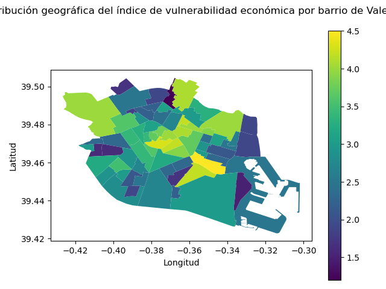

# Análisis de Vulnerabilidad Económica y su Relación con indicadores de disponibilidad de bicicletas como servicio público y nivel de ruido en Valencia

Este proyecto analiza la vulnerabilidad económica en distintas zonas de Valencia y su posible relación con indicadores como el nivel medio de ruido y la disponibilidad de bicicletas de transporte público. Se emplean técnicas de estadística descriptiva, visualización de datos y pruebas de hipótesis como ANOVA para investigar patrones y diferencias entre grupos.

---

## Estructura del Proyecto

- **`data/`**: Contiene los datos utilizados en el análisis.
  - `vulnerabilidad-por-barrios.csv`: Datos de vulnerabilidad económica por zonas.
  - `mapa-soroll-24h-mapa-ruido-24h.csv`: Datos de nivel de ruido por puntos de medición.
  - `valenbisi-disponibilitat-valenbisi-dsiponibilidad.csv`: Datos de disponibilidad de biciletas como servicio público por puntos de medición.
- **`src/funciones.py`**: Funciones personalizadas para el análisis y visualización.
- **`images/`**: Contiene las visualizaciones generadas en el análisis.
- **Notebook Principal**: 
  - `Proyecto Valencia2.ipynb`: Contiene todo el código, visualizaciones y resultados del análisis.

---

## Requisitos Previos

### Librerías Necesarias
El análisis se realiza en Python y requiere las siguientes librerías:

```bash
pip install pandas numpy geopandas matplotlib seaborn scipy chardet shapely ast
```

---

## Ejecución del Proyecto

1. **Preparar el entorno**:
   - Clonar este repositorio.
   - Asegurarse de tener instaladas las dependencias necesarias (ver arriba).

2. **Ejecutar el Notebook**:
   Abra el archivo `Proyecto Valencia2.ipynb` en Jupyter Notebook o JupyterLab y ejecute las celdas en orden.

3. **Resultados**:
   - Visualizaciones generadas sobre los niveles de ruido y la disponibilidad de bicicletas.
   - Resultados del análisis estadístico con pruebas ANOVA.

---

## Resumen del Análisis

- **Carga y Exploración de Datos**:
  - Se cargaron y exploraron datos sobre vulnerabilidad económica, ruido y bicicletas.
  - Se detectó un fuerte desbalanceo en la distribución de vulnerabilidad económica (predominio de baja vulnerabilidad).

- **Visualizaciones**:
  - Mapas geográficos para visualizar la distribución de las variables por zonas.
  - Gráficos estadísticos para comparar grupos.

- **Pruebas Estadísticas**:
  - Se utilizó ANOVA para evaluar diferencias entre grupos.
  - No se encontraron diferencias significativas en las variables analizadas.

---

## Limitaciones

1. No se verificó la potencia estadística ni los supuestos de normalidad y homocedasticidad para ANOVA.
2. El desbalanceo en la distribución de las muestras podría afectar la interpretación de los resultados.
3. Los resultados deben tomarse con cautela, dado el carácter exploratorio del estudio.

---

## Visualizaciones Destacadas (Ejemplo)

 

---

## Licencia

Este proyecto está licenciado bajo la Licencia MIT. Consulte el archivo `LICENSE` para obtener más información.

---

## Contacto

Para preguntas o sugerencias, puede contactar al autor a través de [jfrometa99@gmail.com] o abrir un issue en este repositorio.


```python

```
